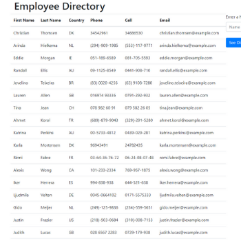

# Employee-Directory

<h3><u>Title: Employee-Directory<u></h3>
<h5><i>React JS<i></h5>

<h3>Description:</h3> 
    This project delivers a React JS app-- Employee Directory -- that allows a user to view a list of employees and dynamically search the directory.  The employee information is provided by third-party API, Random User, (whuch generates a random list of 50 employees each time the directory is run).
    The sample "Employee" information is presented in a table with first name, last name, country location, phone, cell, and email.  At the bottom of the table, the user can enter part of a name and the list will dynamically update to match the user's input.

<h3>Overview Snapshot of User Interface:</h3> 

    

<h3>Installation:</h3>
    To set-up the development environment, clone the repository found at https://github.com/lauramparker/Employee-Directory. To run the application, the following npm packages need installation:
   npm install
   npm install react
   npm install react-dom
   
   To run the application locally, navigate to the path containing the employee-dir folder and, from the command line, enter npm start.  The app will build and automatically open (usually on port 3000).
    
  

<h3>Usage:</h3>
    Use this project as an example of a React JS App.

<h3>Credits:</h3> Laura Parker @lauramparker (author)

<h3>License:</h3> MIT   <i>Please use this project for your own learning!</i> 
